柳超-逻辑回归：从入门到精通 知识点梳理
====
## Introduction

> 什么是逻辑回归？逻辑回归可以说是互联网领域应用最广的自动分类算法了：从单机运行的垃圾邮件自动石碑程序到需要成百上千台机器支持的互联网广告投放系统，算法主干都是LR。

> 逻辑回归看起来比较简单，其实简简单单了解算法是怎么一回事到工作当中遇到问题还是很容易碰壁的，比如说对于L1正则化在大规模LR模型中该怎么做算法优化，为啥你用BFGS跑的总是比别人慢等等。柳超大牛在《逻辑回归：从入门到精通》在内容上注重讲解对LR的理解以及背后的优化算法掌握。此外还将了最速梯度下降法，到牛顿方法，再到拟牛顿方法（DFP，BFGS，L-BFGS等算法）

## 初识逻辑回归

> 给定N个训练样本（x1, y1), (x2, y2), ..., (xN, yN), 其中xi是一个n维向量用来表示第i个样本在这n个特征上的取值，yi {-1, +1}表示了这个样本是正样本还是负样本。逻辑回归模型就是通过一个叫做sigmoid函数 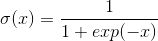将第i个样本的特征向量xi与该样本为正样本的概率联系了起来
> 
> 概率函数如下`公式1`： 
> 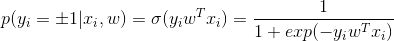  
> 这个公式是怎么来的呢: 
> 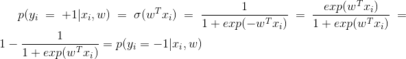  
> 这样一来就能够综合以上式子了。
 
### 评估数据的数据流变化过程
- **1**. 传入一组数据xi
- **2**. 参数矩阵w^T点乘xi再乘以 -1，得到一个分数值
- **3**. 利用sigmoid函数把该值压缩到0-1范围内，得到的数值就是该样本为正样本的概率
- **4**. 如果正样本概率大于0.5，该样本就是为正样本

### 目标函数
> 逻辑回归的目标就是要找到最好的w，使得正样本的分数比较大，同时负样本的分数比较小。想象一下，对于进来的数据计算正样本的概率值，最好的结果难道不是正样本算出来的概率都为1， 负样本算出来的概率都为0吗？严格来说，LR是通过最大似然估计原则来找到最好的w，其基本的想法就是找到这样一组w使所有样本在`公式1`下最大，即： 
> 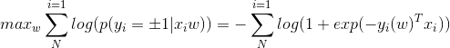  
> 通常来说，优化问题倾向于解决最小化问题，所以上式可以转化为下面的式子`公式2`： 
> 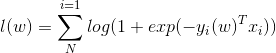  
> 在这里，l(w)是一个凸函数，如图：
> 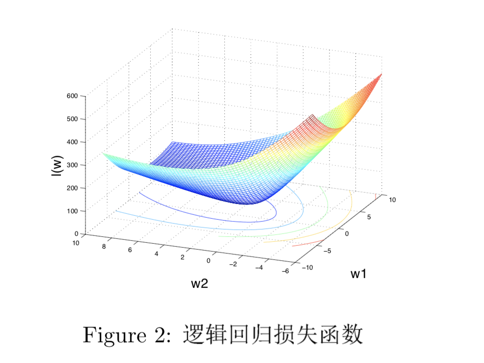
> 因此，我们可以沿着这个曲面滑下去，从而达到稳定的最小点。各种优化算法的区别就是在于选择沿着哪个方向往下滑，以及不同场景下的用途，不同的方向往下滑通常是由目标函数在当前的一阶导数与二阶导数。 
> tips: 极大似然估计是建立在极大似然原理的基础上的一个统计方法，是概率论在统计学中的应用。极大似然估计提供了一种给定观察数据来评估模型参数的方法，即：“模型已定，参数未知”。通过若干次试验，观察其结果，利用试验结果得到某个参数值能够使样本出现的概率为最大，则称为极大似然估计。

#### l(w)一阶导数
> 利用sigmoid函数的性质 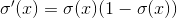和导数链式法则，可以算出l(w)对w的梯度为： 
> 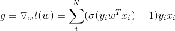

#### l(w)二阶导数(海森矩阵)
> l(w)二阶导数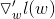，我们先算其中的一个元素：
> 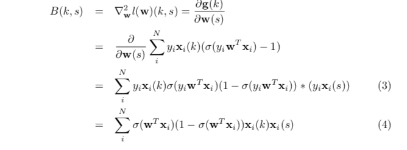
> 有了B(k, s)就可以将B写成矩阵形式了：
> 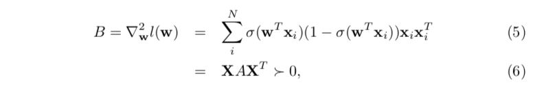
> 其中X = [x1, x2, ..., xn], A 为对角矩阵，其第i个元素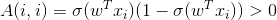 式子6说明l(w)的海森矩阵为正定矩阵，所以l(w)是严格的凸函数

### L1 vs. L2规则化

> L1 L2规则化的出现就是为了能够避免过拟合而造出来的，通常使用w的模作为规则化因子
> `看原文`

### 求解L2规则化的逻辑回归
> 

